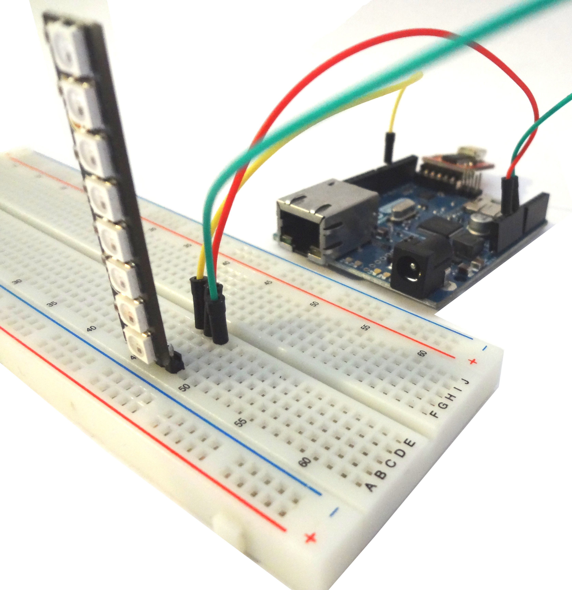

## Requirements
See [Parts Comparison](/robbi5/buildlamp/wiki/Part-Comparison) for a general idea of what you'll need.

## About

This is a pretty easy way to setup a ethernet ready Buildlamp, just plug in a network cable and you can change color and animation via GET Request.

## Construction How To
This buildlamp was build with this [Guide](https://learn.adafruit.com/adafruit-neopixel-uberguide/arduino-library) with the same power source for the arduino as the neopixel. 

## LED Test

[link zum gewitter sketch](../arduinoEthernetSketch/lightning.idn)

## Webserver Test

[link zum einfachen server sketch](../arduinoEthernetSketch/simpleServer.idn)
you may have to configure IP and Mac Address 

## ColorServer Code and Documentation

[Link zu dem Webserver API](../arduinoEthernetSketch/colorserver/server.sketch)

 

