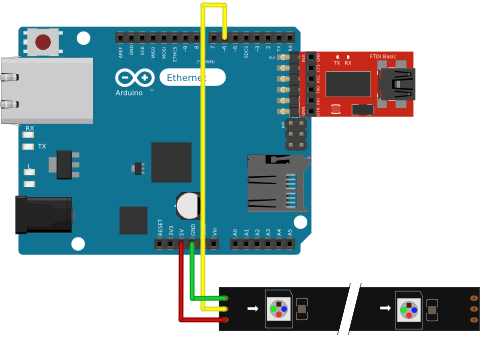

# buildlamp — Arduino Ethernet and NeoPixels variant
## Requirements
### Parts
* [Arduino Ethernet](http://arduino.cc/en/Main/ArduinoBoardEthernet)
* [USB Serial Adapter](http://arduino.cc/en/Main/USBSerial) for programming the Arduino Ethernet
* 7-12V power supply
* [NeoPixel Stick](http://www.adafruit.com/products/1426) or multiple [breadboard friendly NeoPixels](http://www.adafruit.com/products/1312)
* [Break-away headers](http://www.adafruit.com/products/392) for soldering on neopixels
* [breadboard](http://www.adafruit.com/products/65)
* [breadboard wires](http://www.adafruit.com/products/153)

### Libraries
Import the following libraries into your Arduino IDE:
* [mthread](https://github.com/jlamothe/mthread)
* [Adafruit_NeoPixel](https://github.com/adafruit/Adafruit_NeoPixel)

## Construction How To

### Preparing the NeoPixels
* Solder the break-away headers on your breadboard friendly NeoPixels or the NeoPixel Stick

### Connect on breadboard

Look at this [in depth Guide](https://learn.adafruit.com/adafruit-neopixel-uberguide/arduino-library) how to connect the NeoPixels to the arduino.

 

### Upload Code to the Arduino

Connect the Arduino with the USB Serial Adapter to your computer. Open the [buildlamp sketch](./buildlamp.ino) and change the lines marked with `// FIXME`. Then upload the sketch to the Arduino.

### Setup Jenkins Job

Open your Jenkins instance, go to _Manage Jenkins_ > _Manage Plugins_ and install the [_Groovy Postbuild_](https://wiki.jenkins-ci.org/display/JENKINS/Groovy+Postbuild+Plugin) plugin.

Create a new View that contains all the jobs you want to summarize the build status on the lamp.

Create a new Job (type: _Freestyle project_) with following settings:
* Source Code Management: none
* Build Triggers: Build periodically, Schedule: "`* * * * *`"
* Build > Add Build step: Execute groovy script. Copy the contents of [/jenkins/buildlamp.groovy](/robbi5/buildlamp/blob/master/jenkins/buildlamp.groovy) in the Groovy command text box and change the `FIXME` values.

### Look at your lamp

If its no longer blue, *party*! :tada: 
