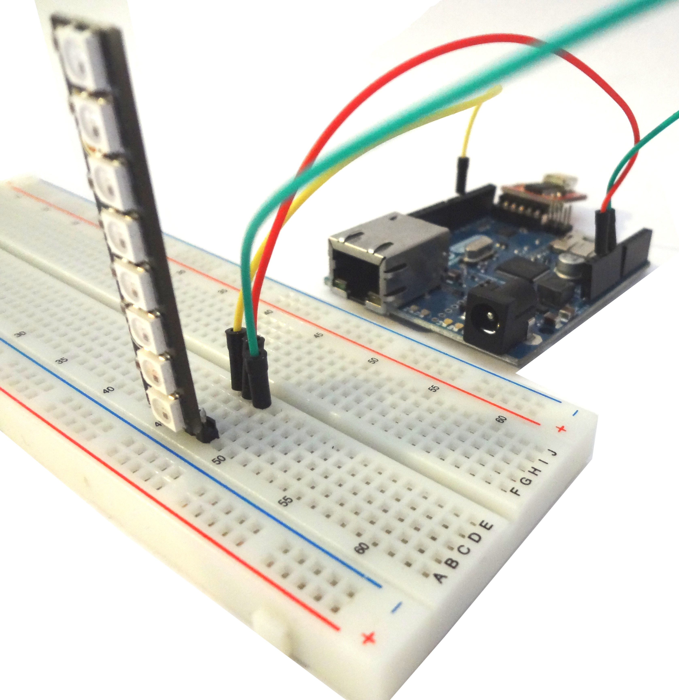

## About

This is a pretty easy way to setup a ethernet ready Buildlamp, just plug in a network cable and you can change color and animation via GET Request.

## Requirements
### Parts
See [Parts Comparison](/robbi5/buildlamp/wiki/Part-Comparison) for a general idea of what you'll need.

### Libraries
get [mthread](https://github.com/jlamothe/mthread)
and [Adafruit_NeoPixel](https://github.com/adafruit/Adafruit_NeoPixel)
and import them into your Arduino IDE

## Construction How To
This buildlamp was build with this in depth [Guide](https://learn.adafruit.com/adafruit-neopixel-uberguide/arduino-library) with the same power source for the arduino as the NeoPixels. The guide tells you everything about construction, libraries and programming the arduino.

## LED Test

[led test sketch](./ledTest.idn)

## Webserver Test

[webserver sketch](../webserverTest.idn)
you may have to configure IP and MAC Address. Then open that IP on your browser. You lamp should change color now

## ColorServer Code and Documentation

### TODO - Jenkins ready colorServer
[Link zu dem Webserver API](../arduinoEthernetSketch/colorserver/server.sketch)

 

